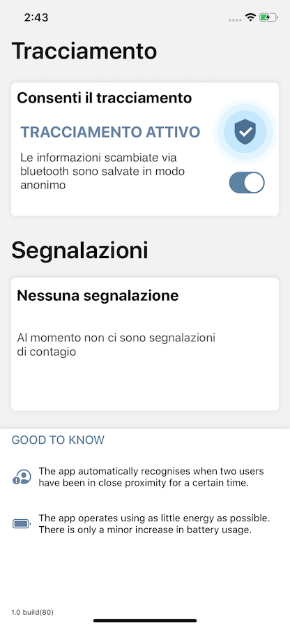

# Safety@work for iOS

 

Heavily based on project DP3T (https://github.com/DP-3T/dp3t-sdk-ios)

Table of contents
=================

<!--ts-->
- [Safety@work for iOS](#safetywork-for-ios)
- [Table of contents](#table-of-contents)
- [DP3T](#dp3t)
  - [Introduction of DP3T](#introduction-of-dp3t)
- [Safety@work iOS App](#safetywork-ios-app)
  - [Prerequisites](#prerequisites)
  - [How Application works](#how-application-works)
  - [Screenshot](#screenshot)
    - [Onboarding step 1](#onboarding-step-1)
    - [Onboarding step 2](#onboarding-step-2)
    - [Onboarding step 3](#onboarding-step-3)
    - [Onboarding step 4](#onboarding-step-4)
    - [Main](#main)
    - [Main Infected](#main-infected)
  - [Languages supported](#languages-supported)
- [BTP Mobile Services app configuration](#btp-mobile-services-app-configuration)
- [Tutorials for SAP Business Technology Platform mobile services and SDK for iOS](#tutorials-for-sap-business-technology-platform-mobile-services-and-sdk-for-ios)
- [License](#license)
<!--te-->

DP3T
====
The Decentralised Privacy-Preserving Proximity Tracing (DP-3T) project is an open protocol for COVID-19 proximity tracing using Bluetooth Low Energy functionality on mobile devices that ensures personal data and computation stays entirely on an individual's phone. It was produced by a core team of over 25 scientists and academic researchers from across Europe. It has also been scrutinized and improved by the wider community.

DP-3T is a free-standing effort started at EPFL and ETHZ that produced this protocol and that is implementing it in an open-sourced app and server.

## Introduction of DP3T
This is the first implementation of the DP-3T "low bandwidth" protocol. The current implementation does not use the  "Contact Tracing" API of Apple/Google--**and has limitations as a result**. 
Our "hybrid approach" uses Bluetooth Low Energy (BLE) to exchange `EphID`s. It uses advertisements whenever possible and falls back to GATT Server connections if not possible to transmit/collect an `EphID` this way (e.g., on iOS devices when the app is in background). This approach can result in higher energy consumption and scalability issues and will be replaced by the Apple/Google API.

Safety@work iOS App
===================

Safety@work has 3 main functionalities:

1. garantee contact distance (based on RSSI and tx power level)
2. contact tracing (DP3T heavily based)
3. iBeacon integration protocol (for real time meeting room and common space monitoring)

The app takes advantage on SAP Business Technology Platform mobile services and is built using SAP Business Technology Platform SDK for iOS versione 5.0.4,

Onboarding is developed using SAP CLoud Platform SDK for iOS Assistant

Proxy Class generation for Odata service are developed by SAP Business Technology Platform SDK for iOS Assistant

## Prerequisites

The Project takes advantage on classes from DP3T open-source project (folder Sources), 
dependencies are managed with Swift Package dependencies, you can extract BTP for iOS SDK framework from the Assistant application

and import in project Frameworks folder.

You have to turn-on some capabilities

Application leverage on:

- **UserNotification**
- **CoreBluetooth**
- **Corelocation** (only for iBeacons monitoring, app doesn't trace the GPS user location)
- **SQLite** to store EphemeralID received from others devices
- **BackgroundTask** from iOS13 Apple introduce the background task to execute code in background. To enable them the app has to support the Background process capability and include the name of your task in the BGTaskSchedulerPermittedIdentifiers Info.plist property.

Project structure

- [Sources]  DP3T sources 
- [Proxy Classes]  SAP Business Technology Platform SDK for iOS Assistant generated proxy classes
- [Onboarding] SAP Business Technology Platform SDK for iOS Assistant generated onboarding classes
- [Networking]  Wrappers classes for Odata Communication
- [ViewController]  ViewController classes 

If you installed backend on Sap Cloud Platform services you have to modify some properties in

    OnBoarding/AppParameters.plist 
    -Application identifier
    -destination name

and

    OnBoarding/ConfigurationProvider.plist 
    -HRphoneNumber (phone number of your own Hr departement)
    -scpAppId (id of your app on BTP)
    -host (host of mobile services)

to match your appID or your host.

Tested on 
    
    iOS version **13.0,13.4,13.4.1,13.5** (iPhone and iPad)
    Build with **Xcode 11.4,11.5**
    **Swift 5.0+**

Images from

    Undraw (https://undraw.co/illustrations ) under free license (https://undraw.co/license)
    Images from Icons-8 (icons8-security_checked and icons8-warning_shield)

All other images are owned by SAP

## How Application works

Application works on DP3T core based on anonymous exchange of ID between iOS Devices through Bluetooth,
When application starts user is informed about scop of application and use of Bluetooth,IBeacon and notification asking for authorization.
After onboarding on the main screen user can 

    turn on/turn off tracing
    know if any of your colleagues met in the last few days is infected

In background the app scan for sepcifice bluetooth service and broadcast ephemeralID, when find a device with safety@works installed start to comunicate ephemeralID and ask the other device to send Its own epehermalID.

EphemeralID broadcasted is a token like this **24 b5 a4 17 0b b1 55 3d ba de 10 f3 d1 d5 e5 7e** and for security reason change every 15 minutes. the ephemeralID doesn't contain information about device or user.

This application is an enterprise application so work in a centralized mode, when background task is woke up by iOS send to backend:

    1 my ephemeral ID brodacasted in the current day
    2 the ephemeral IDs with whom I have been in contact for more than 5 minutes and with a distance (based on RSSI) sufficient for the infection 
    
If an employee is infected by Covid-19 and sent mail to HR department, the application backend find all the ephemeralID with whom the epmloyee has been in contact and send a push notification on the possibile infected employees device.

If two or more employees doesn't respect safety distance a notification appear on employee device.

When employees meet each others in a meeting room or a common space where is present a bluetooth beacon,  iPhone send to backend **anonymously** that a new employee enter in a meeting room or in a common space.

In this way on the backend facility administrator knows in real time how many people are inside the meeting room or in a common space.

## Screenshot

### Onboarding step 1 

### Onboarding step 2 

### Onboarding step 3 

### Onboarding step 4 

### Main  

### Main Infected

## Languages supported

    Italian
    English

BTP Mobile Services app configuration
=====================================
On mobile services a new `Native application` must be created and linked to the existing project. Below picture shows the application available within BTP Mobile services.

That application must have following feature assigned:

- **Mobile client log upload** - in order to submit all logs stored in mobile app;
  
- **Mobile client usage and feedbacks** - necessary to keep track of user activities, within BTP Mobile services, in interacting with the app;
  
- **Mobile connectivity** - this feature is the "core" one: it is mandatory to properly configure destinations that point to back-end business logic (see next section for a deep dive into configuration details);
  
- **Mobile push notification** - in order to push back-end messages, this feature must be in place and, a valid `.p12 certificate` must be configured properly (in order to communicate with APNS);
  
- **Mobile Settings exchange** - necessary to properly manage all additional settings of the app (e.g. pincode structure, biometric features, etc...).

About **Mobile connectivity** feature, two destinations must be configured, as depicted in following picture:

Paths to destinations must be:

Name | URL
-----|-----
safetyatworkdestination | https://*\<cv-19-tracing-xsjs module path\>*/odata/services.xsodata
xsjsFunctions | https://*\<cv-19-tracing-xsjs module path\>*/xsjs/functions.xsjs

Where `<cv-19-tracing-xsjs module path>` is the path to the **xsjs** module of back-end MTA app:

Once accessed the application in the CF Space cockpit, the url can be found in the **Application routes** section:

Tutorials for SAP Business Technology Platform mobile services and SDK for iOS
==============================
Check out these tutorials and courses for deep-dives into various areas
* [Mobile Interactive Tutorials](https://www.sap.com/developer/tutorial-navigator/mobile-interactive-tutorials.html)
* [Community Tutorials](https://www.sap.com/developer/topics/cloud-platform-sdk-for-ios.html)
* [openSAP course](https://open.sap.com/courses/ios2)

License
=======
Copyright (c) 2020 SAP SE or an SAP affiliate company. All rights reserved. This project is licensed under the Apache Software License, version 2.0 except as noted otherwise in the [LICENSE](LICENSES/Apache-2.0.txt) file.
